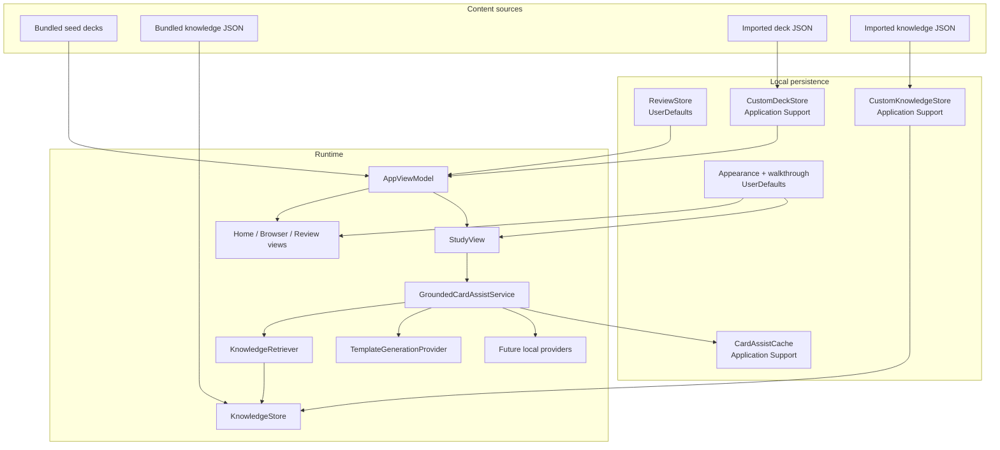

# Architecture

## Design Goals

- keep startup fast
- keep the codebase small and readable
- keep the default build fully useful offline
- make content portable with plain JSON
- make the assist layer replaceable without rewriting the UI

## Runtime Diagram

## Layer Breakdown

### App Shell

`StudyCardsApp.swift` creates the top-level stores and injects them into SwiftUI:

- `ReviewStore`
- `AppViewModel`
- `AppearanceStore`

The root shell stays small on purpose.

### Models

Core value types:

- `Deck`
- `FlashCard`
- `DeckFile`
- `KnowledgeDocument`
- `CardAssistRequest`
- `CardAssistResponse`

The import/export DTOs are intentionally simple so users can author or version them by hand.

### View Model

`AppViewModel` is the single app-level coordinator for:

- loading built-in and imported decks
- search/filter helpers
- last-opened deck tracking
- deck export helpers
- startup recovery notices

This keeps the SwiftUI screens thin without introducing extra architecture layers.

### Persistence

The app uses two storage styles:

- `UserDefaults`
  - marked card IDs
  - last-opened deck ID
  - appearance mode
  - first-run walkthrough state
- `Application Support`
  - imported decks
  - imported knowledge
  - assist cache

The split is deliberate: small preference-like values stay simple, while larger payloads use file-backed storage.

### Knowledge And Assist

`KnowledgeStore` loads:

- bundled knowledge documents for built-in decks
- imported knowledge documents for exact `deck_id` matches
- synthesized fallback knowledge from deck cards when no explicit knowledge exists

`KnowledgeRetriever` is intentionally lightweight:

- exact title match
- alias match
- tag overlap
- keyword scoring
- related-concept lookup

There is no vector database yet. The retriever is the seam where semantic search can be added later.

`GroundedCardAssistService` coordinates:

1. request assembly from the current study card
2. local knowledge retrieval
3. generation via a provider boundary
4. local caching

### Generation Providers

Current provider:

- `TemplateGenerationProvider`

Placeholders for future local inference:

- `FoundationModelsGenerationProvider`
- `MLXGenerationProvider`

The current open-source build remains useful without any local model installed.

## Study Flow

1. `StudyView` selects the current `FlashCard`
2. the user flips, swipes, marks, or asks for assist
3. assist builds a `CardAssistRequest`
4. `KnowledgeStore` returns the matching local knowledge set
5. `KnowledgeRetriever` ranks the most relevant documents
6. a provider formats a grounded response
7. `CardAssistCache` stores the result for later reuse

## Extension Points

- add more bundled deck JSON and knowledge JSON
- import custom decks and matching knowledge at runtime
- add a public deck catalog on top of the existing JSON schema
- plug in a local model provider later
- swap review logic for a spaced-repetition scheduler without changing deck content formats

## Why This Stays Small

This app deliberately avoids:

- backend synchronization
- heavyweight persistence frameworks
- plugin runtimes
- generic chat architecture
- multiple nested view models for simple screens

The project is easier to audit and contribute to because the data flow is still direct.
