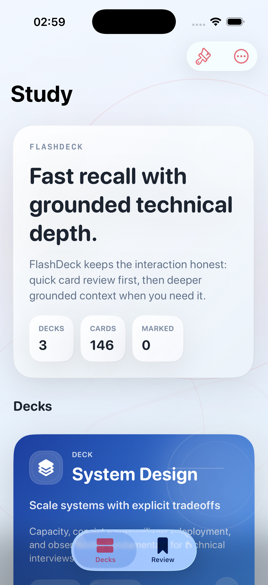
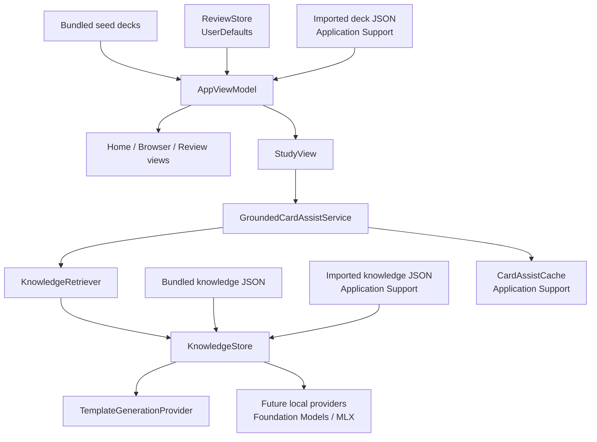

# FlashDeck

FlashDeck is a local-first iOS study app for system design, solution architecture, and AWS review.

It is intentionally narrow: fast deck review, grounded card assistance, simple import/export, and no backend dependency in the default build.

The name reflects the core interaction directly: quick card-based recall first, with enough grounded depth to support stronger technical understanding.

## Demo

Home screen on the current simulator build:



## Why This App Exists

Most flashcard tools optimize for generic study workflows. This app is narrower on purpose.

The rationale:

- technical interview prep benefits from repetition, recall, and tradeoff thinking more than from feature-heavy study systems
- architecture topics are easier to retain when cards stay concise but still include practical tradeoffs
- AI assistance should help explain a card or compare adjacent concepts, not replace the deck as the source of truth
- a small native SwiftUI codebase is easier to maintain, audit, and extend as an open-source project

This project is designed to stay useful on first launch:

- bundled decks ship with the app
- review state stays local
- grounded assist works without cloud services
- custom decks and knowledge can be added with plain JSON

## What Ships Today

- native SwiftUI iPhone/iPad app
- bundled decks for System Design, Solution Architecture, and AWS Services
- card-by-card study with tap-to-flip and swipe navigation
- review marking, marked-only sessions, random sessions, and weak-area placeholder mode
- offline grounded Card Assist for `Explain`, `Compare`, `Quiz Me`, and `Feedback`
- JSON import/export for custom decks
- JSON import/export for deck knowledge used by assist
- Light, Dark, Reading, and E-Ink style appearance modes
- GitHub-release-friendly unsigned IPA build flow

## Product Boundaries

- no account, sync, or authentication in the default build
- no ads, analytics SDKs, or tracking
- no generic chat interface
- no bundled large model
- no cloud inference in the default open-source build
- no spaced repetition scheduler yet

## Architecture At A Glance



See [ARCHITECTURE.md](ARCHITECTURE.md) for the deeper walkthrough.

## Core Design Decisions

### Local Knowledge Is The Source Of Truth

Card Assist is grounded in local deck knowledge, not generic model memory. The current card and the matching local knowledge documents are the authoritative inputs.

### Small Extension Surface

The app uses plain JSON for decks and knowledge packs. That keeps content portable, reviewable, and easy to version in Git.

### Replaceable Assist Layer

The assist pipeline is built around retrieval plus a generation-provider boundary. The default open-source build uses deterministic templates, while future local model providers can slot in without rewriting the study UI.

### Lightweight Persistence

Small preference-like values stay in `UserDefaults`. Larger mutable payloads, such as imported decks, imported knowledge, and assist cache entries, are stored in `Application Support`.

## Privacy And AI

- no account, auth, sync, analytics, ads, or backend in the default build
- review state, imported decks, imported knowledge, appearance preferences, walkthrough state, and assist cache stay on-device
- Card Assist is narrow and card-scoped, not chat
- imported runtime knowledge applies only to the exact matching `deck_id`
- bundled knowledge can still provide category fallback for built-in decks

See [PRIVACY.md](PRIVACY.md) and [AI_POLICY.md](AI_POLICY.md).

## Build And Run

Open `FlashDeck.xcodeproj` in Xcode and run the `FlashDeck` scheme on an iPhone simulator or device.

Command line simulator build:

```sh
xcodebuild \
  -project FlashDeck.xcodeproj \
  -scheme FlashDeck \
  -configuration Debug \
  -destination 'platform=iOS Simulator,name=iPhone 17 Pro' \
  build
```

Command line test run:

```sh
xcodebuild \
  -project FlashDeck.xcodeproj \
  -scheme FlashDeck \
  -destination 'platform=iOS Simulator,name=iPhone 17 Pro' \
  test
```

## Create A Release IPA

Use the included release script locally:

```sh
./scripts/create-release-artifacts.sh
```

It builds an unsigned device IPA and writes:

- `release/FlashDeck-sideload.ipa`
- `release/FlashDeck-sideload.ipa.sha256`

Important:

- the IPA is for device sideloading only
- simulator testing uses the built `.app`, not the IPA

For sideloading steps, see [INSTALL.md](INSTALL.md).

## GitHub Release Flow

CI already runs on pushes and pull requests. Release packaging is tag-driven.

When a tag like `v1.0.1` is pushed, GitHub Actions will:

1. run the simulator test suite
2. build the unsigned device IPA
3. generate the SHA-256 checksum
4. build a simulator `.app.zip` artifact
5. publish those files to the matching GitHub Release

Published release assets:

- `FlashDeck-sideload.ipa`
- `FlashDeck-sideload.ipa.sha256`
- `FlashDeck-simulator.app.zip`

## Installable Decks And Community Content

This app is intentionally moving toward installable content packs rather than raw file management as the primary discovery flow.

The recommended open-source direction is:

- official bundled decks in this repository
- plain JSON deck packs attached to GitHub Releases
- public catalog manifests hosted on GitHub Pages or raw JSON endpoints
- community-created deck repositories using stable `deck_id` and `card_id` values

What this project should avoid:

- executable plugins
- opaque binary deck bundles
- scraping runtimes or source adapters that execute arbitrary code

The right content model for this app is reviewed, portable JSON.

See [ROADMAP.md](ROADMAP.md) for the next steps.

## Repository Guides

- [ARCHITECTURE.md](ARCHITECTURE.md)
- [INSTALL.md](INSTALL.md)
- [ROADMAP.md](ROADMAP.md)
- [LICENSE](LICENSE)
- [SECURITY.md](SECURITY.md)
- [SUPPORT.md](SUPPORT.md)
- [CONTRIBUTING.md](CONTRIBUTING.md)
- [CODE_OF_CONDUCT.md](CODE_OF_CONDUCT.md)
- [PRIVACY.md](PRIVACY.md)
- [AI_POLICY.md](AI_POLICY.md)
- [CRAWLING.md](CRAWLING.md)
- [CHANGELOG.md](CHANGELOG.md)
- [CITATION.cff](CITATION.cff)

## Support

Use GitHub Issues for reproducible bugs, deck pack problems, and roadmap proposals.

See [SUPPORT.md](SUPPORT.md).

## License

This repository is released under the MIT License. See [LICENSE](LICENSE).
